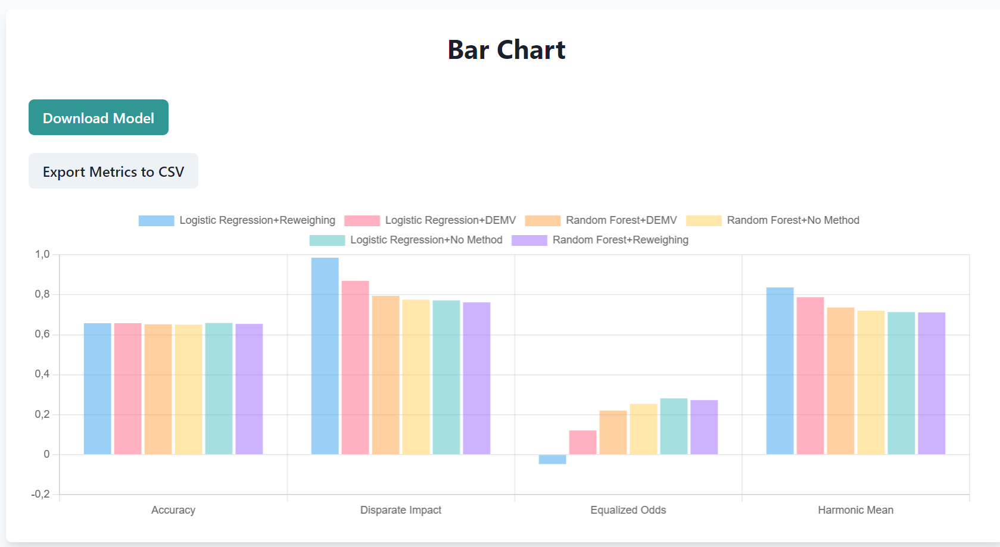

# 4. Visualizing the Results

After executing the experiment in the server, you are redirected to the _Results_ page. This page is divided into three sections: _Bar Chart_, _Raw Results_, and _How to Read the Metrics_.

The first sections shows the obtained metric for each setting in a bar chart. As you can see from the harmonic mean, _Logistic Regression + Reweighing_ is the setting obtaining the best _fairness_ and _effectiveness_ trade off.

You can see the same results in the _Raw Results_ section and understand how to read the metrics in the last section.

Finally, you can download the results and the fully trained ML model by clicking the buttons above.

:::{tip}
Congratulations! You have evaluated the fairness and effectiveness of different ML settings and identified the best one using MANILA!
:::
