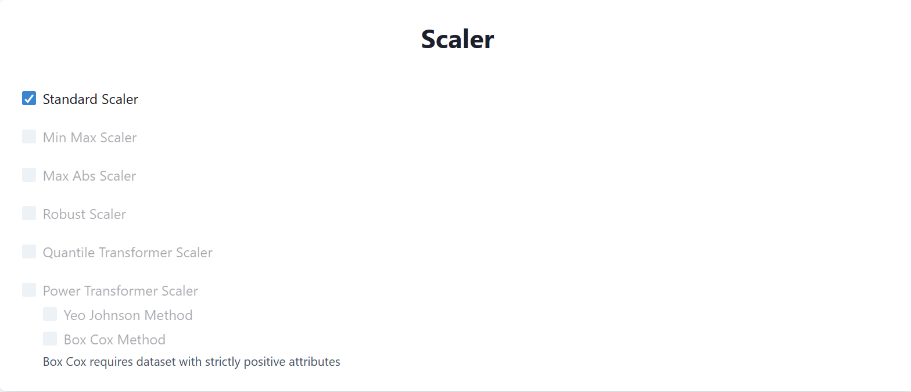
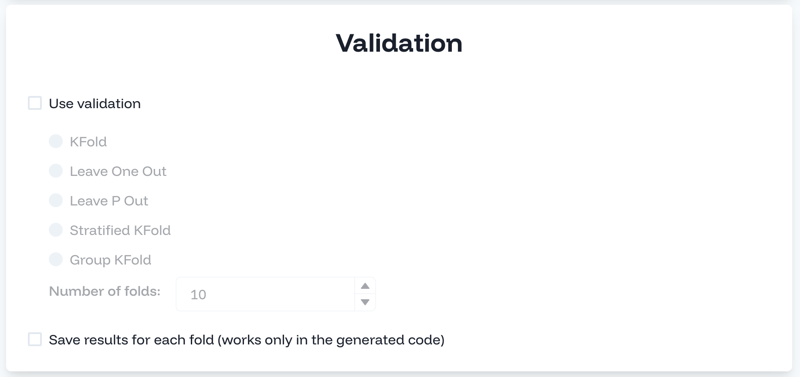

# 3. Use MANILA

MANILA is divided into different sections that allow you to specify the different features of your experiment.

## 3.1. Dataset

The first section requires you to specify information about the input dataset.

- The dataset you are using is a `csv` dataset, hence specify `CSV` in the _File Extension_ field.
- Next, you have to specify information about the label. In our case, the label is _binary_ and its name in the dataset is `two_year_recid`. Finally, you have to specify the _positive_ value of the label (i.e., the one towards the discrimation is performed), which is `0` in our case.
- Next, you have to specify the _sensitive variables_ of the dataset (i.e., the ones identifying the protected groups). In our case, we have one sensitive variable named `race`. Hence, specify that the dataset has a single sensitive variable and put `race` in the **Variable Name** field. Finally, specify the values in the dataset identifying the **Unprivileged** and **Privileged** groups, which are `0` and `1` respectively.

:::{note}
The values of the sensitive variables must be encoded into numerical values. For example, if the sensitive variable is `sex` and the values are `male` and `female`, then you have to encode them into numerical values (e.g., `0` and `1`).
:::

- Finally, the dataset has the index encoded into the first column and contains the header. Hence, specify that the dataset has the index column in position `0` and that it contains the header.

Eventually, the specification of the dataset should look like the following:

## 3.2. Scaler

In this section, you can specify a scaler to be applied to the dataset. In our case, we will use the `Standard Scaler`, hence select it from the list.

## 3.3. ML Task

In this section, you can specify the machine learning task you want to perform and the relative ML algorithms. In our case, we will perform a _binary classification_ task using _Logistic Regression_ and _Random Forest_ models, hence select them from the list.

You can also specify to save semi-trained models (i.e., models trained on only the training set) and the training size (i.e., the percentage of the dataset to be used for training). In our case, we will not need to save the semi-trained models and we will use the default value of `80%` of the dataset for training.

:::{note}

MANILA will automatically disables ML models not compatible with other selected features. For instance, it will disable ML models not compatible with some selected fairness methods (e.g., _Reweighing_ is not compatible with _MLP Classifier_).

:::

## 3.4. Quality Methods

In this section, you can specify methods related to some quality attributes. At this time, MANILA contains only methods related to _fairness_. In future, it will include methods enhancing other quality attributes (e.g., _explainability_).

In our experiment, we want to evaluate the fairness of the ML methods alone and with the _Reweighing_ and _DEMV_ methods. Hence, select `fairness` and then check `No Method`, `Reweighing`, and `DEMV` from the list.

## 3.5. Metrics

In this section, you can specify the metrics to be used to evaluate the ML settings in terms of _effectiveness_ and _fairness_.

The metrics are divided into three sections: _Classification_, _Regression_, and _Fairness_ metrics.
In our case, the _Regression_ metrics are disabled since we are performing a _classification_ task.

Concerning classification metrics, select _Accuracy_ among the list.

Then, you have to specify fairness metrics. These metrics are divided into _group_ and _individual_ fairness metrics. In our case, we are evaluating _group fairness_ definitions, hence check this option.

Then, metrics are grouped into two main categories _Equally_ fairness and _Proportional_ fairness. _Disparate Impact_ belongs to the first category, while _Equalized Odds_ belongs to the second one. Hence, check both of them and select _Disparate Impact_ and _Equalized Odds_.

Finally, there is the section to specify the aggregation function to be used to aggregate the different metrics. In our case, we will use the _Harmonic Mean_.

## 3.6. Validation

In this section, you can specify the cross-validation strategy. You will not use cross validation in this tutorial, hence leave the section unchecked.

## 3.7. Upload dataset

Finally, you can upload the dataset to perform the evaluation on the server. To do so, click on the empty field and upload the dataset you have downloaded at the beginning of the tutorial.

## 3.8. Run the experiment

Finally, you can run the experiment by clicking on the _Run_ button. The experiment will be executed on the server and you will see the results in the _Results_ page.
